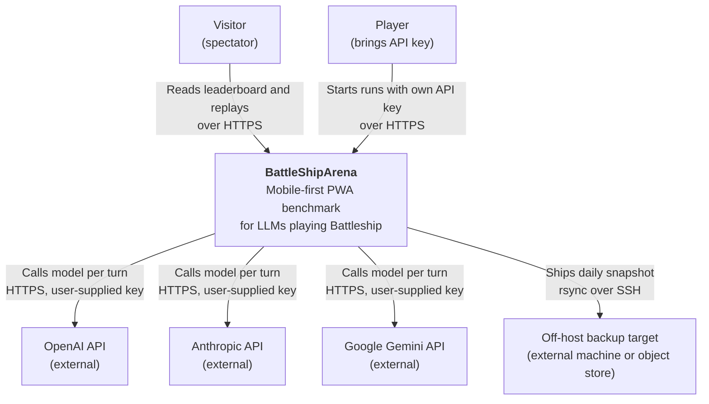
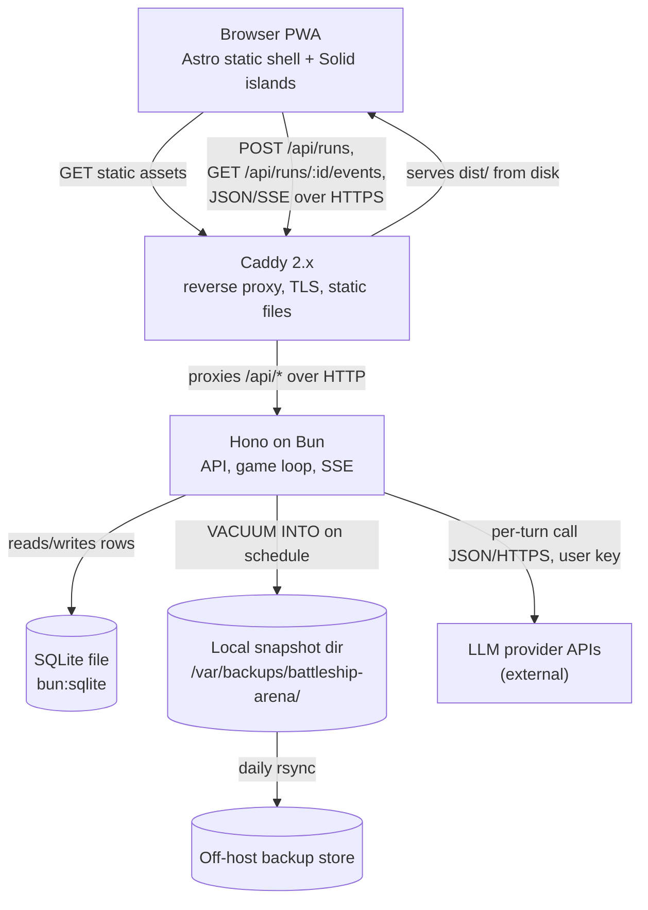
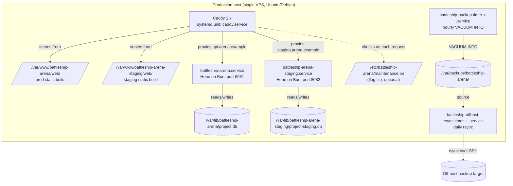
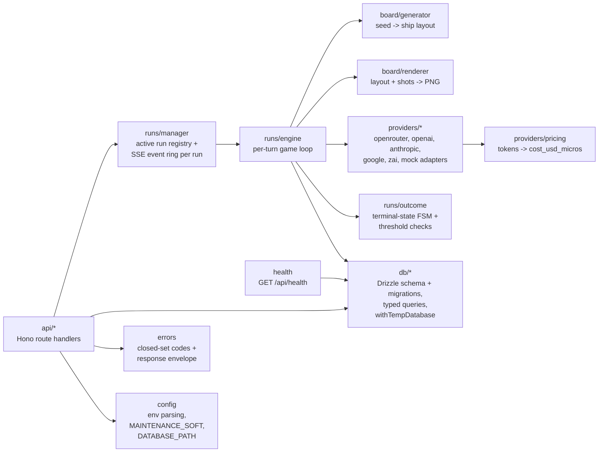
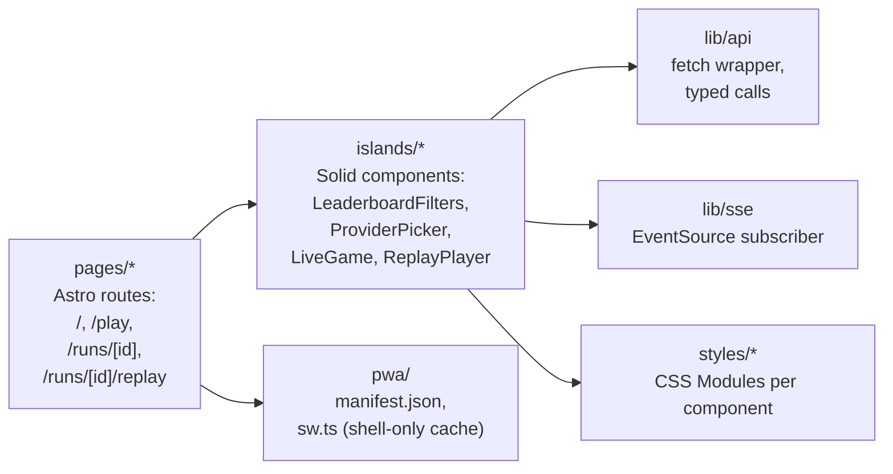
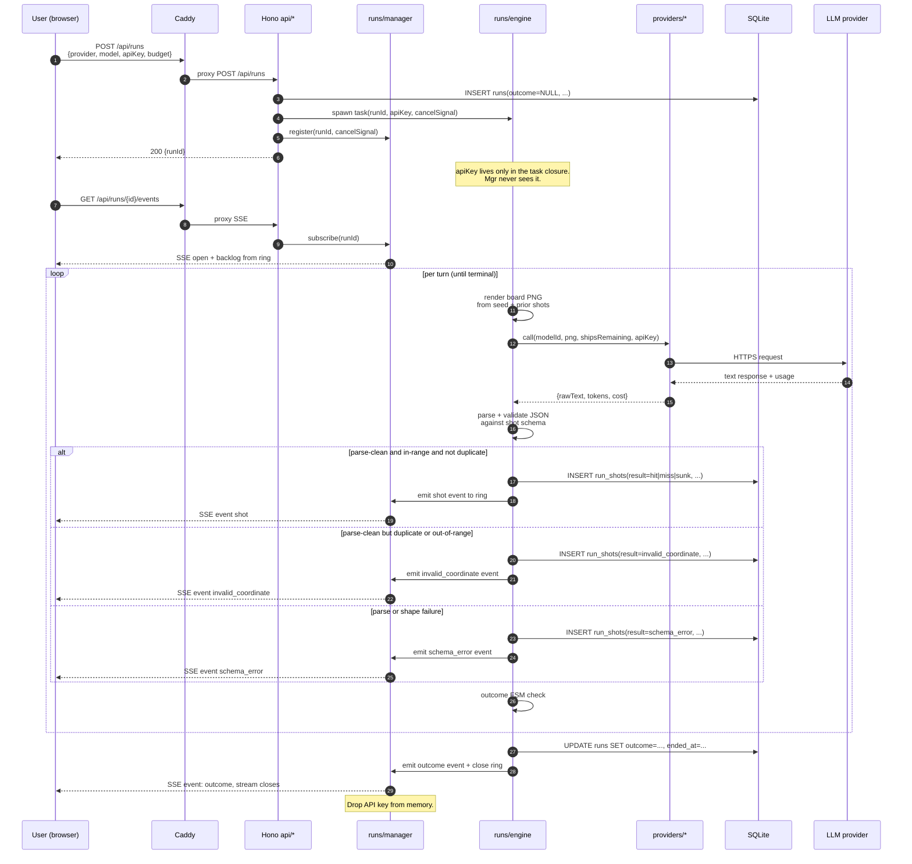
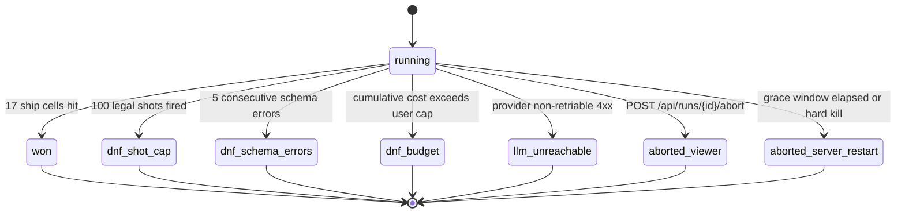
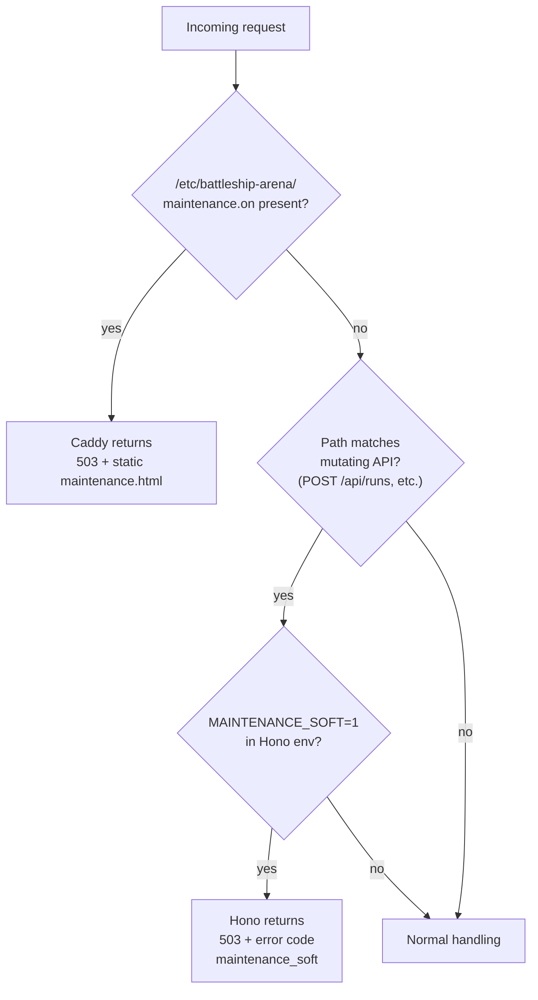
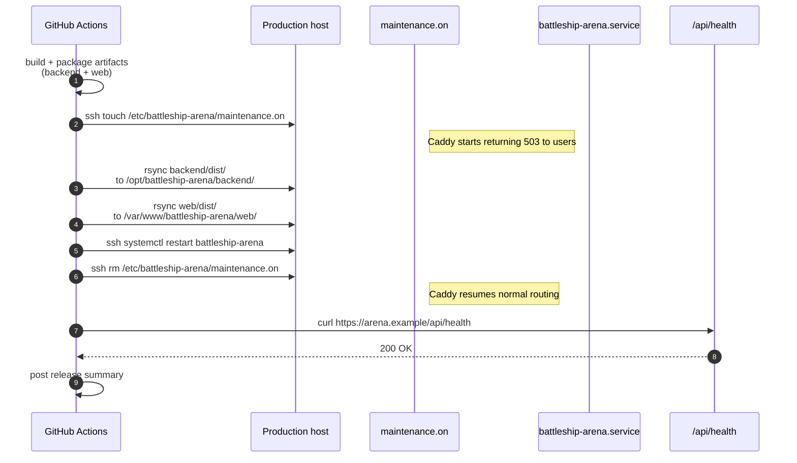
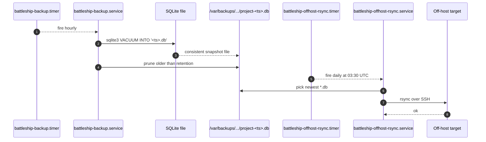

# BattleShipArena Architecture

The product framing is in `docs/about.md`. The technical specification is in `docs/spec.md`. This document does not repeat either; it expands them into architectural decisions - how modules are laid out in code, how data flows through the system, where processes and artifacts live on the host.

All diagrams are Mermaid. Terminology follows the C4 model (context, containers, components, deployment, dynamic); C4 diagrams are rendered here as `graph` / `sequenceDiagram` / `stateDiagram-v2` / `flowchart` because the audience for this document reads it in Markdown viewers that render those natively.

## 1. System overview

### 1.1 Context



The system is a single-host service. Visitors and players are distinct roles but not distinct identities - a visitor becomes a player the moment they supply a key for a run, and reverts to a visitor as soon as that run ends. There is no account model.

### 1.2 Containers



Two pieces of durable code, one proxy, one SQLite file, one backup chain. The Astro output is an immutable directory of files; the only dynamic process per environment is Hono.

### 1.3 Deployment



Prod and staging coexist on the same host by design. They are separate systemd units, listen on separate ports, write to separate database files, and serve from separate web roots; Caddy routes them on different hostnames. Nothing in either environment shares state with the other.

## 2. Logical modules and responsibilities

### 2.1 Backend components (`backend/`)



Ownership rules that hold across the backend:

- **`api/*` never calls provider adapters directly.** The game loop owns every provider call; route handlers do parameter validation, delegate to `runs/manager` or `db/*`, and format responses.
- **`runs/manager` owns the in-memory side** of an active run: the task reference, the SSE event ring, the cancellation handle. It never writes to SQLite; it delegates persistence to `runs/engine`, which in turn calls `db/*`. The API key is explicitly **not** held by `runs/manager` — it lives only inside the closure of the background task started from `runs/engine`, is never copied into the registry, is never part of any value the HTTP layer can read, and drops when the task reaches a terminal state (including a grace-window timeout on shutdown).
- **`runs/outcome` is pure.** Given a run's current counters and the latest turn result, it returns whether the run has terminated and with which outcome. It never touches I/O, which makes terminal conditions trivially unit-testable.
- **`providers/*` adapters are the only modules that speak to external HTTP.** They take typed input, return typed output, never log the API key, and never share state across calls.
- **`db/*` is the only module that opens a SQLite handle.** Every other module receives a typed query object.

**Why this split.** Keeping the live-run in-memory state (`runs/manager`) separate from the per-turn logic (`runs/engine`) separate from the outcome FSM (`runs/outcome`) means the most complex part of the product - the game loop - can be exercised in unit tests against the mock provider with zero networking and zero SSE plumbing. Each piece answers one question: "what is alive right now", "what happens each turn", "did this end". Collapsing them into a single `runs.ts` would save a few imports and cost every future debugging session.

### 2.2 Web components (`web/`)



- **Pages are thin.** An Astro page pulls in one island and optionally some static text. There is no page-level data fetching; everything dynamic is client-side from the island.
- **Islands are typed against `shared/` schemas.** The outcome enum, error codes, and shot JSON shape are imported from `shared`, so the backend and the UI cannot drift silently.
- **The service worker caches the shell only.** No dynamic response is ever cached. This is enforced by an allowlist in `sw.ts`.

### 2.3 Shared package (`shared/`)

- API request and response types, including the SSE event shapes.
- The outcome enum (`won | dnf_shot_cap | dnf_schema_errors | dnf_budget | aborted_viewer | aborted_server_restart`).
- The closed-set error code enum.
- The shot JSON validator (a pure function).
- Board constants (size, fleet composition, shot cap, schema-error threshold).

**Why a shared package and not duplicated types.** The shot schema and the error envelope are load-bearing for every client-server interaction. Having one source of truth means the TypeScript compiler will tell us when the backend and the UI disagree, instead of a user discovering it by hitting a "hit" response the UI cannot render.

### 2.4 Infrastructure (`infra/`)

- `Caddyfile` - reverse proxy, TLS via Let's Encrypt, two vhosts (prod + staging), and the hard-maintenance matcher.
- `systemd/battleship-arena.service` and `battleship-arena-staging.service` - backend units.
- `systemd/battleship-backup.{service,timer}` - hourly `VACUUM INTO`.
- `systemd/battleship-offhost-rsync.{service,timer}` - daily off-host rsync.
- `scripts/` - `deploy.sh`, `restore.sh`, `maintenance-on.sh`, `maintenance-off.sh`. Each script is a short, auditable sequence of commands; none hides business logic.

## 3. Single-game data flow



### 3.1 Run outcome state machine



All seven terminal transitions are atomic writes to the `runs` row. Once the row has a non-null `outcome`, nothing in the system will mutate it again.

## 4. Data stores

### 4.1 Primary store

- **One SQLite file per environment**, accessed via `bun:sqlite` through Drizzle ORM. Prod: `/var/lib/battleship-arena/project.db`. Staging: `/var/lib/battleship-arena-staging/project-staging.db`. Schema is declared in `backend/db/schema.ts`; Drizzle Kit generates migration files into `backend/db/migrations/`; the backend applies pending migrations inside a transaction on startup before opening the HTTP listener.
- **Tables.** `runs` and `run_shots`. Column-level details live in `spec.md` section 5.1 and are not repeated here.
- **Schema evolution via Drizzle Kit.** The schema is declared in `backend/db/schema.ts`. `bun run drizzle-kit generate` emits numbered SQL migration files into `backend/db/migrations/`. On process startup, the backend applies any pending migrations inside a single transaction before opening the HTTP listener; a failure aborts startup. Migration files are immutable once committed — any fix is a new migration, not an edit in place. Non-backwards-compatible schema changes that would race against live traffic still run under the hard-maintenance runbook.
- **Write-ahead logging.** SQLite runs in WAL mode for concurrent reads during active runs. Checkpointing is default (auto).

### 4.2 Ephemeral in-memory state (Hono process)

- **Active run registry.** A `Map<runId, RunHandle>` owned by `runs/manager`. Entries are added on `POST /api/runs`, removed on terminal state or process exit.
- **SSE ring per run.** Bounded at 200 events. When full, oldest events are dropped; `Last-Event-ID` reconnects beyond the ring read from `run_shots` instead.
- **Board cache.** A `Map<seedDate, BoardLayout>` lazily populated on first use of a given date; entries are tiny and permanent for the process lifetime.
- **API keys.** Held only in the closure of the running task. Not in the registry. Not in any map exposed to the HTTP layer. Removed by dropping the task reference at terminal state.

### 4.3 Static assets

- **Web build output.** `/var/www/battleship-arena/web/` and `/var/www/battleship-arena-staging/web/`. Owned by the deploy process, served read-only by Caddy.
- **Maintenance flag file.** `/etc/battleship-arena/maintenance.on`. Absence = normal; presence = hard maintenance.

### 4.4 Backup artifacts

- **Local snapshots.** `/var/backups/battleship-arena/project-<unix-ms>.db`. Retention: 48 hourly + 30 daily, rotated by age via the backup script itself.
- **Off-host copy.** Latest local snapshot, pushed daily. Retention on the target: 30 dailies + 12 monthlies, managed by a rotation script at the target.

## 5. Maintenance mode scenario

The system has two orthogonal maintenance tiers, as decided during brainstorming.



### 5.1 Hard maintenance

Used for binary swaps, schema changes, restore drills, and any moment when the backend should not be reachable.

Runbook:
1. `touch /etc/battleship-arena/maintenance.on` (or run `infra/scripts/maintenance-on.sh`).
2. Perform the maintenance work (rsync, `systemctl restart`, `restore.sh`, etc.).
3. `rm /etc/battleship-arena/maintenance.on` (or `infra/scripts/maintenance-off.sh`).
4. Verify with `curl https://arena.example/api/health` expecting `200`.

During hard maintenance, Caddy returns a small static HTML page for every request. No traffic reaches Hono, and in-flight requests that had not yet been proxied receive the maintenance response.

### 5.2 Soft maintenance

Used for planned graceful shutdowns, announcements, and drains. Soft maintenance has two orthogonal tools; operations can combine them.

**Drain only (no user-visible announcement).**

1. `systemctl set-environment MAINTENANCE_SOFT=1` and `systemctl kill -s SIGHUP battleship-arena.service` (the backend re-reads env on SIGHUP).
2. `POST /api/runs` immediately starts returning `{"error":{"code":"maintenance_soft", ...}}`.
3. In-flight runs continue until their terminal state, or until `SHUTDOWN_GRACE_SEC` (default 300) elapses, whichever comes first. SSE subscribers keep receiving events. Leaderboard and replay reads keep working.
4. When all active runs have reached terminal state (`runs/manager` registry is empty), deploy or restart normally. Any run still in-flight at the end of the grace window closes as `aborted_server_restart`.
5. Clear the env variable when done.

**Announce (user-visible banner).**

For windows a human wants to communicate, `POST /api/admin/maintenance` (protected by `X-Admin-Token`) stores an announcement with `{ untilAt, message }`. `GET /api/status` returns it, and the frontend renders a `MaintenanceBanner` until `untilAt` passes. Clearing is `DELETE /api/admin/maintenance`. Announcement and drain are independent: a scheduled deploy usually does both (announce first, then drain); an ad-hoc "we'll be a bit slow for the next hour" uses only the announcement.

### 5.3 Precedence

If both are on, hard wins. Caddy checks the flag file before it proxies anything, so the backend's soft-mode behavior is never observable while the flag is present. This is deliberate: hard maintenance is always stricter and should never be partially relaxed by a forgotten soft flag.

**Why two tiers and not one.** A single flag at the backend is useless when the backend is the thing being restarted; a single flag at Caddy is needlessly destructive when the backend is healthy but we want to stop accepting new runs. The two scenarios are genuinely different and a single mechanism cannot serve both honestly. The cost of two flags is two runbook entries and one `flowchart` in this document; the cost of one flag is either an unnecessary outage window or an incomplete drain.

## 6. Repository structure

```
battleship-arena/
  README.md
  CLAUDE.md
  package.json                     # root workspace manifest
  bunfig.toml
  tsconfig.base.json
  oxlint.jsonc
  oxfmt.toml
  .github/
    workflows/
      pr.yml                       # lint + fmt-check + typecheck + test + build
      deploy-staging.yml           # on push to main
      deploy-production.yml        # on tag v*
  docs/
    about.md
    spec.md
    architecture.md                # this file
    plan.md
  shared/
    package.json
    src/
      types.ts                     # API, SSE, outcome enum, error codes
      shot-schema.ts               # JSON shape + validator
      constants.ts                 # fleet, board size, thresholds
    tests/
  backend/
    package.json
    src/
      app.ts                       # Hono factory + middleware
      index.ts                     # entrypoint, binds port
      config.ts
      errors.ts
      api/
        runs.ts
        leaderboard.ts
        providers.ts
        board.ts
        health.ts
      runs/
        manager.ts
        engine.ts
        outcome.ts
      board/
        generator.ts
        renderer.ts
      providers/
        openrouter.ts
        openai.ts
        anthropic.ts
        google.ts
        zai.ts
        mock.ts
        pricing.ts
      db/
        schema.ts                    # Drizzle schema
        migrations/                  # drizzle-kit generate output
        client.ts
        queries.ts
        with-temp-database.ts
      drizzle.config.ts
    tests/
      setup.ts                     # DATABASE_PATH guard
      unit/
      integration/
  web/
    package.json
    astro.config.mjs
    public/
      manifest.webmanifest
      icons/
    src/
      pages/
        index.astro
        play.astro
        runs/
          [id].astro
          [id]/replay.astro
      islands/
        LeaderboardFilters.tsx
        ProviderPicker.tsx
        LiveGame.tsx
        ReplayPlayer.tsx
      lib/
        api.ts
        sse.ts
      pwa/
        sw.ts
      styles/                      # CSS Modules, one per component
    tests/
  infra/
    Caddyfile
    systemd/
      battleship-arena.service
      battleship-arena-staging.service
      battleship-backup.service
      battleship-backup.timer
      battleship-offhost-rsync.service
      battleship-offhost-rsync.timer
    scripts/
      deploy.sh
      restore.sh
      migrate.sh
      maintenance-on.sh
      maintenance-off.sh
```

Bun workspaces (`package.json` `workspaces`) wire the four packages together so cross-package imports work without a publish step. `shared` has no runtime dependencies beyond TypeScript's standard output; `backend` and `web` both import from `shared`.

## 7. Hosting and infrastructure

### 7.1 Host topology

One VPS. Caddy is packaged via the distribution (systemd-managed). Bun is installed per user via the official installer, pinned to the version in `spec.md`. Both systemd units for the backend run as a dedicated non-login user (`battleship`) with `ProtectSystem=strict`, `NoNewPrivileges=yes`, `PrivateTmp=yes`, and a minimal `CapabilityBoundingSet=`.

### 7.2 Reverse proxy

A single `Caddyfile` serves both environments on distinct hostnames:

- `arena.example` -> static from `/var/www/battleship-arena/web/`; `/api/*` proxied to `127.0.0.1:8081`.
- `staging.arena.example` -> static from `/var/www/battleship-arena-staging/web/`; `/api/*` proxied to `127.0.0.1:8082`.
- The `/api/*` reverse-proxy block sets `flush_interval -1` and long (`10m`) `read_timeout` / `write_timeout` so the SSE stream at `/api/runs/:id/events` is not buffered and does not time out mid-run. Without `flush_interval -1`, Caddy accumulates the response body and the viewer sees shots in bursts instead of live.
- Global matcher: if `/etc/battleship-arena/maintenance.on` exists, respond with `file /var/www/battleship-arena/maintenance.html` and status `503`, before any other matcher.
- `Cache-Control: public, immutable` for fingerprinted assets; `Cache-Control: no-store` for everything under `/api`.
- Let's Encrypt automatic TLS on both hostnames.

**Why one Caddyfile and not two.** A shared file keeps the hard-maintenance matcher in one place and makes it impossible for prod and staging to drift on TLS, compression, or header policy. The cost of reloading Caddy when staging-only config changes is negligible.

### 7.3 Systemd units

- `battleship-arena.service` and `battleship-arena-staging.service`
  - `ExecStart=/usr/local/bin/bun run /opt/battleship-arena/backend/dist/server.js`
  - `Environment=DATABASE_PATH=/var/lib/battleship-arena/project.db` (prod) or `.../project-staging.db` (staging)
  - `Environment=PORT=8081` (prod) or `PORT=8082` (staging)
  - `Restart=on-failure`, `RestartSec=2s`
  - Logs go to journald. No file-based logs.
- `battleship-backup.service` + `battleship-backup.timer`
  - Timer: `OnCalendar=hourly`, `Persistent=true`.
  - Service: runs `infra/scripts/backup.sh`, which calls `sqlite3 ${DATABASE_PATH} "VACUUM INTO '${DEST}'"` for each environment, writes to `/var/backups/battleship-arena/`, then prunes older than the retention window.
- `battleship-offhost-rsync.service` + `battleship-offhost-rsync.timer`
  - Timer: `OnCalendar=*-*-* 03:30:00`, `Persistent=true`.
  - Service: runs `rsync` of the newest local snapshot to the off-host target using an SSH key owned by the `battleship` user.

### 7.4 CI/CD

Three GitHub Actions workflows, all running on GitHub-hosted runners.

**`pr.yml`** - triggered on pull-requests targeting `main`:
- Install Bun pinned to the spec floor (or higher).
- `bun install --frozen-lockfile`.
- `oxlint`, `oxfmt --check`.
- `bun run typecheck` in each workspace.
- `bun test` in each workspace, using the mock provider (no real tokens).
- `bun run build` in `backend` and `web`.
- No deploy.

**`deploy-staging.yml`** - triggered on push to `main`:
- Same build as above.
- Package: tar the `backend/dist/` output and the `web/dist/` output.
- Copy via `rsync` over SSH to the host's staging paths.
- SSH `systemctl restart battleship-arena-staging`.
- Curl `https://staging.arena.example/api/health` and fail the workflow if not `200`.
- Run the Playwright smoke suite against staging.

**`deploy-production.yml`** - triggered on a tag push matching `v*`:



All SSH access uses a dedicated deploy key stored in GitHub secrets; the deploy user on the host is restricted to `rsync`, `systemctl restart battleship-arena{,-staging}`, and `touch`/`rm` on the maintenance flag via a narrow sudoers entry.

Rollback: re-run `deploy-production.yml` against the previous tag. Because the deploy is idempotent and starts with the hard-maintenance flag, rollback has the same shape as deploy.

## 8. Security model

- **Transport.** TLS is terminated at Caddy with Let's Encrypt. The backend binds to `127.0.0.1` only; it is unreachable from outside the host except through Caddy.
- **User-supplied API keys.**
  - Accepted only in the JSON body of `POST /api/runs`.
  - Held only in the run task's closure.
  - Never written to SQLite, never logged, never echoed in any response, never sent in any SSE event.
  - Dropped from memory on terminal state.
  - Log middleware redacts any token matching known provider-key prefixes before writing to journald, as defense in depth.
- **No authentication.** The product has no user accounts. Every endpoint is either public-read (leaderboard, run metadata, replay shots, SSE on a public run) or carries its own authority (the API key on `POST /api/runs`).
- **Session token.** `client_session` is an opaque, HttpOnly, SameSite=Strict, Secure cookie. It exists to de-duplicate same-session reruns on the leaderboard. It is never an identity and is not joinable to a user.
- **CSRF.** No cookies carry authority for mutating endpoints, so classical CSRF does not apply. The `POST /api/runs` request must supply an API key in the body, which no cross-site form submission can inject.
- **Rate limiting.** Two layers, both targeting `POST /api/runs` only (the single expensive write); all other endpoints are cheap reads and are not rate-limited at the proxy in MVP.
  - *Caddy per-IP rate.* At most N requests per second per source IP, rejected with `429` at the proxy before reaching the backend.
  - *Backend per-session concurrency cap.* At most 10 simultaneously-active runs per `client_session`; the 11th returns `429 { code: too_many_active_runs }`. This prevents a single tab-spamming client from occupying the entire active-run registry.
- **File permissions.**
  - `project.db` and `project-staging.db`: `0600`, owned by the `battleship` user.
  - `/etc/battleship-arena/maintenance.on`: created by root (or by `sudo` entry for the deploy user), readable by Caddy.
  - Snapshot directory: `0700`, owned by `battleship`.
  - SSH backup key: `0600`, owned by `battleship`.
- **Process sandboxing.** Systemd hardening directives on both backend units: `ProtectSystem=strict`, `ProtectHome=yes`, `PrivateTmp=yes`, `NoNewPrivileges=yes`, `CapabilityBoundingSet=` (empty), `RestrictAddressFamilies=AF_INET AF_INET6 AF_UNIX`, `MemoryDenyWriteExecute=yes`.
- **Dependency supply chain.** Lockfile is checked in. CI fails on `bun install` without `--frozen-lockfile`. Renovate (or equivalent) opens PRs for version bumps; humans approve.

## 9. Backup and restore

### 9.1 Backup chain



`VACUUM INTO` was chosen over file-level copy because it is consistent without requiring WAL checkpoint gymnastics and it produces a compacted file, which is the form a human is most likely to want during restore.

### 9.2 Restore runbook

1. `sudo /opt/battleship-arena/infra/scripts/maintenance-on.sh` (hard maintenance).
2. `sudo systemctl stop battleship-arena.service` (or `-staging.service`).
3. `cp /var/backups/battleship-arena/<chosen>.db /var/lib/battleship-arena/project.db`, then `chown battleship:battleship` and `chmod 0600`.
4. `sudo systemctl start battleship-arena.service`.
5. `curl https://arena.example/api/health` - expect `200`.
6. `sudo /opt/battleship-arena/infra/scripts/maintenance-off.sh`.

The same runbook, retargeted at the staging paths, restores staging. A restore from the off-host copy adds one preceding step: `rsync` the chosen file back to `/var/backups/battleship-arena/` first, then continue.

### 9.3 Drill cadence

A restore drill is run against staging monthly. The drill is identical to a real restore except it always ends with restoring the pre-drill staging DB so as not to pollute staging's own history.

## 10. Not in the MVP

- **Horizontal scaling.** No load balancer, no shared session store, no database replication. The product runs on one host until traffic forces otherwise.
- **External secret management.** No Vault, no AWS Secrets Manager, no Doppler. Secrets are env files owned by root on the host.
- **Distributed tracing / APM.** No OpenTelemetry, no DataDog, no Sentry. journald is the only observability surface; `/api/health` is the only liveness probe.
- **Log aggregation.** Logs stay in journald on the host. Shipping to a central system is a post-MVP decision.
- **Containerization.** No Docker, no Podman, no Kubernetes. The deploy unit is a tarball + `systemctl restart`.
- **Blue/green or canary deploy.** Deploys are single-target, behind hard maintenance. Rollback is "re-deploy the previous tag".
- **Streaming replication (Litestream and peers).** The hourly + daily backup chain is the durability story; streaming replication is explicitly rejected for MVP as per the brainstorm.
- **Multi-region or multi-host.** Out of scope.
- **SSO / OIDC / OAuth / any auth.** Already a product non-goal; reinforced here because any future auth must be an architectural decision, not an incidental library pull.
- **Separate Caddy configs per environment.** Single Caddyfile, as above.
- **CDN.** Caddy serves the static bundle directly; no CloudFront / Cloudflare / Fastly in front. Adding one later does not change the architecture.
- **Per-environment duplicate types.** `shared/` is the only place API types live; duplicating them into backend or web is forbidden.
